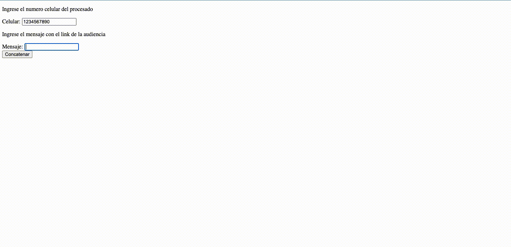

# WhatsApp Link Generator

Is a simple web app develop with python in Flask framework that create a WhatsApp link with message and redirect the user too

## To run

* You need Python 3.9.10 installed in you computer ([Direct link](https://www.python.org/downloads/release/python-3910/))

* As good practice you create a virtual environment with

```Bash
python -m venv venv # to create
env\Scripts\activate # activating
```

* Then install all modules necesary from pip with:

```Bash
python -m pip install -r .\requirements.txt
```

* Later from terminal run the program with:

```Bash
python ./project_package/__init__.py
```

